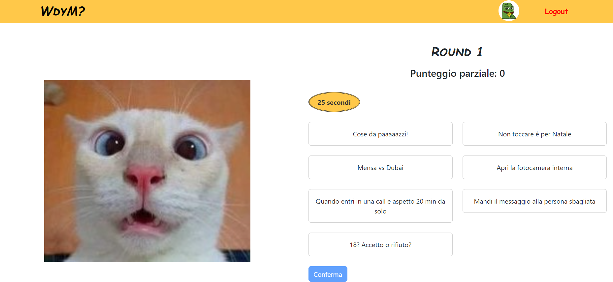
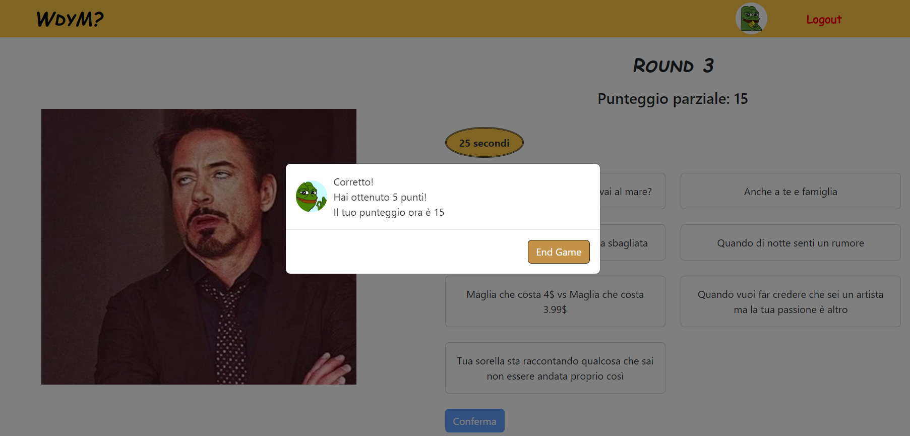
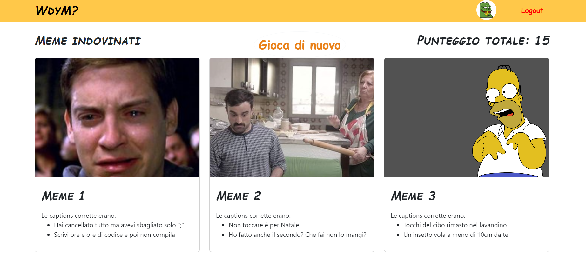
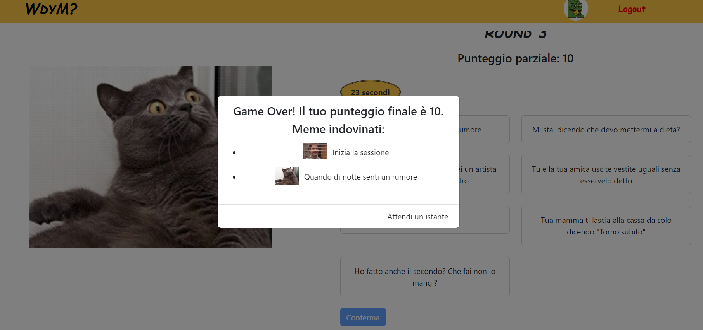

# 🎭 "What do you meme?"

## 👤 Student: **s329502 FIATA ROSAMARIA**  

---

## 🌍 React Client Application Routes

- 🏠 **Route `/`**: Home page providing an overview of the app and access to key sections.
- 🎮 **Route `/game`**: Game page where users can guess the correct meme captions.
- 🔐 **Route `/login`**: Login form for user authentication.
- 👤 **Route `/profile`**: User profile displaying past game results and scores.
- 📊 **Route `/summary`**: Summary of the last game, showing the user's score and correct captions.

---

## 🔗 API Server

### 🔑 POST `/api/login`
📤 **Request Body**:
```json
{
  "username": "user@email.com",
  "password": "user"
}
```
📥 **Response Body**:
```json
{
  "id": 2,
  "name": "User",
  "email": "user@email.com"
}
```

### 🖼️ GET `/api/memes`
📤 **Request Parameters**: None  
📥 **Response Body**:
```json
[
  {
    "id": 1,
    "url": "meme1.jpg"
  },
  {
    "id": 2,
    "url": "meme2.jpg"
  }
]
```

### 📜 GET `/api/userRounds/:userId`
📤 **Request Parameters**: `2` (User ID)  
📥 **Response Body**:
```json
[
  {
    "id": 16,
    "userId": 2,
    "memeId": 1,
    "memeUrl": "meme1.jpg",
    "isCorrect": 1,
    "createdAt": "2024-06-27 16:53:57"
  },
  {
    "id": 17,
    "userId": 2,
    "memeId": 22,
    "memeUrl": "meme22.jpg",
    "isCorrect": 1,
    "createdAt": "2024-06-27 16:53:57"
  }
]
```

### 🏆 POST `/api/game/saveScore`
📤 **Request Body**:
```json
{
  "userId": 1,
  "score": 15
}
```
📥 **Response Body**:
```json
{
  "message": "Score saved successfully"
}
```

---

## 🗄️ Database Tables

- **🧑‍💻 `user`** → `id`, `name`, `email`, `password`, `salt`
- **🖼️ `meme`** → `id`, `url`
- **📝 `caption`** → `id`, `text`, `memeId`
- **🔄 `rounds`** → `id`, `userId`, `memeId`, `memeUrl`, `isCorrect`, `createdAt`
- **🏅 `scores`** → `id`, `userId`, `score`, `createdAt`, `updatedAt`

---

## ⚛️ Main React Components

### 🔑 `LoginForm` (in `AuthComponents.js`)
✅ Displays the login form and manages authentication.

### 🎮 `GamePage` (in `GamePage.js`)
🖼️ Displays memes and allows users to select the correct captions.
📊 Tracks the score and handles game completion.

### 👤 `ProfilePage` (in `ProfilePage.js`)
📌 Displays the user profile with game history.
📊 Calculates and displays total scores.

### 🚀 `Header` (in `Header.js`)
📌 App header with navigation and login/logout buttons.

### 🏡 `HomePage` (in `HomePage.js`)
📜 Presents the home page with an overview of the app.
🎮 Invites the user to start a new game.

### 📊 `SummaryPage` (in `SummaryPage.js`)
📌 Summarizes the last game with scores and correct captions.
🎮 Includes a button to start a new game.

---

## 🖼️ Screenshot

  
  
  
  

---

## 🔑 Users Credentials

- ✉️ **Email**: `user@email.com` | 🔑 **Password**: `user`
- ✉️ **Email**: `prova@example.com` | 🔑 **Password**: `user`

---

## 🚀 How to Run the Application

Ensure that all necessary packages are installed using the following commands:

```sh
(cd client; npm install; npm run dev)
(cd server; npm install; nodemon index.mjs)
```

🎉 **Enjoy "What do you meme?"!** 🚀

